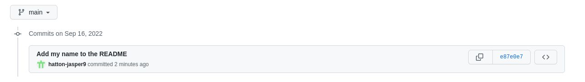
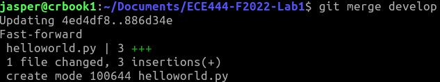
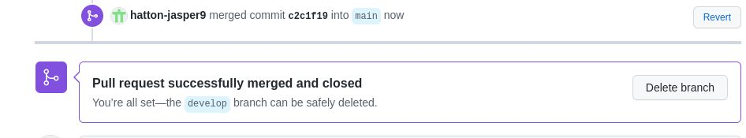
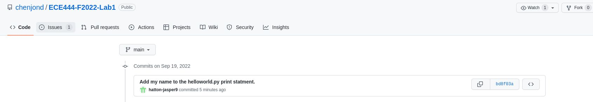
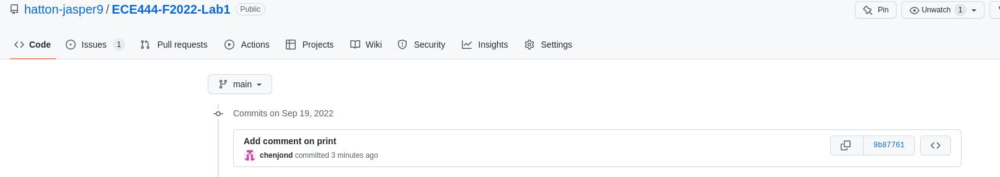
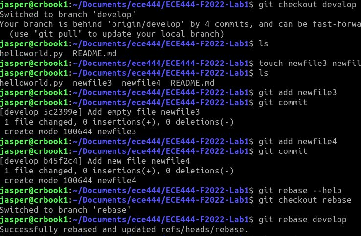

Jasper Hatton

# Activity 1

# Activity 2

# Activity 3

# Activity 4

<https://github.com/chenjond/ECE444-F2022-Lab1>

# Activity 5

# Activity 6

<https://github.com/hatton-jasper9/ECE444-F2022-EP>
